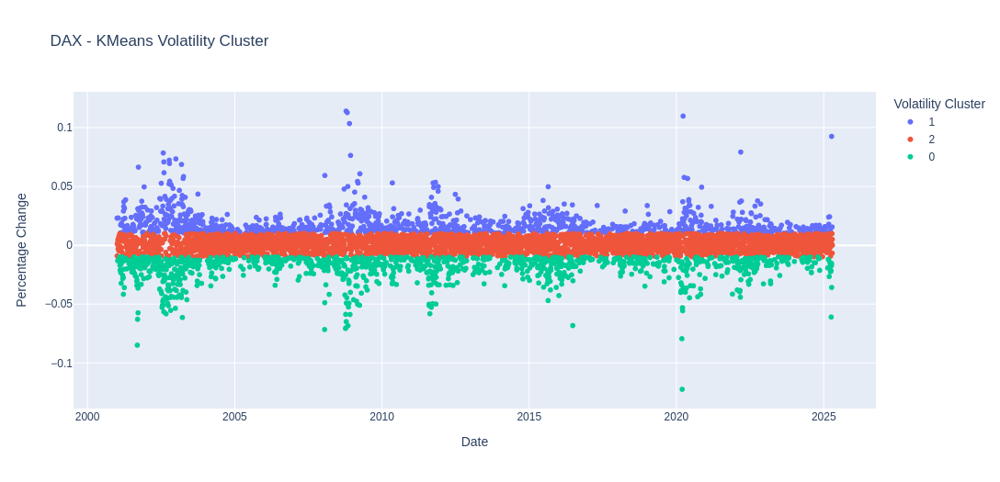
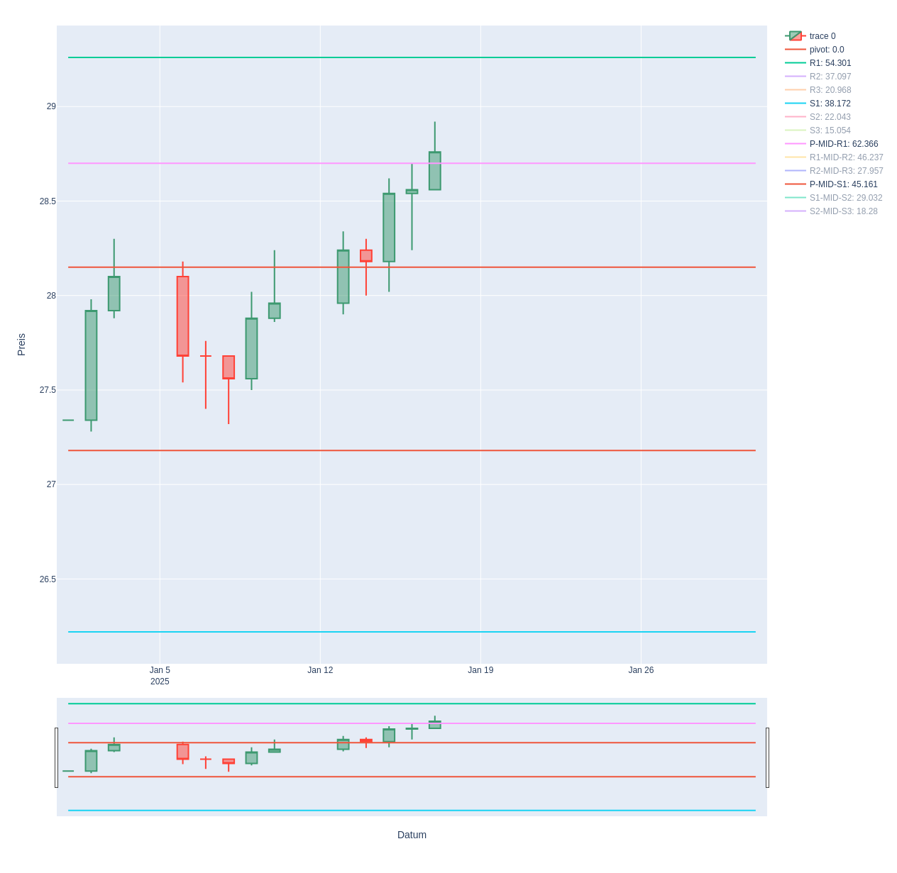
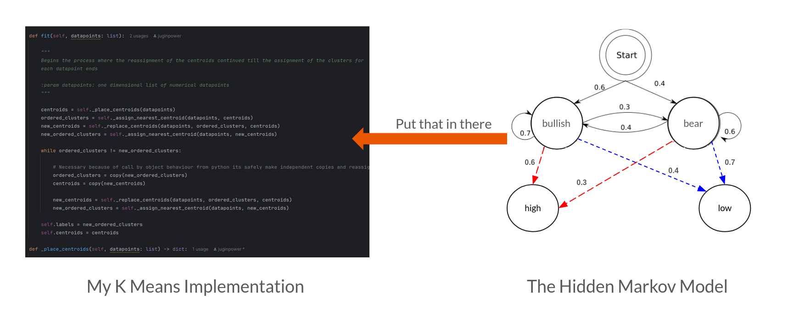

# Analyzer 
## Project description
The goal of this project is to use price analysis and descriptive statistics algorithms to make predictions about the 
performance of certain stocks, companies, or indices on the financial market. Furthermore, the project aims to improve 
my personal financial accounting, allowing me to keep track of my personal income and expenses.


## Useful Features

### KMeans-Volatility-Cluster Indicator


<u>**Explanation**</u>

What you see here is by my self implemented AI KMeans-Clustering-Algorithm. It falls under the category of unsupervised
machine learning algorithms. I use this algorithm to first visually examine the volatility of various stock indices.
The picture show you daily percentage change in the closing price from the dax over the last 20 years.
 
Where the volatility of the percentage change is particularly high, the price also falls during this period. Regardless 
of whether there were percentage changes upwards or downwards. However, it is usually the first downward outliers that 
reveal a bearish phase. In all other cases, the price always rises steeply.

The algorithm works by iteratively assigning data points to clusters based on their proximity to a central point, and 
then recalculating that central point to better represent the assigned data.

If you’re thirsty for more technical details how the algorithm work, I recommend diving into 
[Victor Lavrenko’s video series](https://www.youtube.com/watch?v=_aWzGGNrcic&list=PLIKsw1YCzYKPYvPtUbrcsDT5Y2ILcRm1D&index=29):

[](https://www.youtube.com/watch?v=_aWzGGNrcic)

As an excellent data science teacher, he provides valuable insights and knowledge.

### Pivot Level-Chart



<u>**Explanation**</u>

A working implementation of an algorithm for determining the 
[pivot](https://chartschool.stockcharts.com/table-of-contents/technical-indicators-and-overlays/technical-overlays/pivot-points) 
levels on a chart. And also the probability to reach this levels during the actual month on the right side of the legend 
based on historical data.

### Planed Features

#### KMeans and Hidden Markov Model united
My next vision is to use the [Hidden Markov Model](https://en.wikipedia.org/wiki/Hidden_Markov_model) combined with my
KMeans-Volatility-Cluster indicator like in that picture shown:



**Explanation:**

The special feature of the Hidden Markov Model is the calculation of the probabilities of the states. These states 
could, for example, be the predefined **clusters** of the data points. I want to learn how to calculate transition 
probabilities, which is the probability of a change in state, as well as emission probabilities. So, what is the 
probability that the price will perform higher or lower under a certain state than the previous day? Getting the 
answer I want give these probabilities to a colorpicker to color the current price development. You will 
then see rain showers coming your way as soon as the market is overheated. Like in this weather prediction video from
[Serrano - Academy](https://www.youtube.com/watch?v=kqSzLo9fenk):

[](https://www.youtube.com/watch?v=kqSzLo9fenk)


I already tried an implementation of the HMM like you see below, but get in trouble especially because of the overlapping
probabilities from the best path to a given state which I compute with the help of 
[Viterbi-Algorithm](https://en.wikipedia.org/wiki/Viterbi_algorithm).

```python
import math


def sort_dict_values(item: dict) -> int | float:
    """
    A custom sort helper function to identify with builtin which property needs to be sorted.

    :param item: The dictionary to sort
    :return: An integer or float
    """
    return list(item.values())[0]


def fit(self, datapoints: list, window: int):

    """
    Begins the process of Hidden Markov Model
    """

    def get_direction(number: int | float) -> str:
        """
        Returns a string depended on the parameter

        :param number: A float or integer above or under 0
        :return str: h or l
        """

        if number > 0:
            return "h"
        return "l"

    amount_states = len(self.states)

    for st in set(self.states):
        self.initial_p.update({st: self.states.count(st) / amount_states})
        self._compute_emission_p(st, datapoints)

    self._compute_transition_p()

    direction = get_direction(datapoints[0])

    # First Day state probability
    row_p = [{key: math.log(self.emission_p[key + direction]) + math.log(init_state_p)}
             for key, init_state_p in self.initial_p.items()]
    self.states_p.append(tuple(row_p))
    counter = 0
    for i in range(1, len(datapoints)):
        direction = get_direction(datapoints[i])
        row_p = []
        # Here comes the Viterbi algorithm
        if counter == window:
            row_p = [{key: math.log(self.emission_p[key + direction]) + math.log(init_state_p)}
                     for key, init_state_p in self.initial_p.items()]
            counter = 0
        else:
            yesterday_items = self.states_p[i-1]
            for item in yesterday_items:
                today_state_choices_p = []

                for key in self.initial_p.keys():
                    if key in item.keys():
                        yest_state_p = item.get(key)
                        for t_key in self.transition_p.keys():
                            if key == t_key[:2]:
                                today_state_p = yest_state_p + math.log(self.transition_p.get(t_key)) + math.log(self.emission_p.get(key+direction))
                                today_state_choices_p.append({key: today_state_p})

                today_state_choices_p.sort(key=sort_dict_values, reverse=True)
                row_p.append(today_state_choices_p[0])

        self.states_p.append(tuple(row_p))
        counter += 1
```

I will use the [gics](https://en.wikipedia.org/wiki/Global_Industry_Classification_Standard) standard for determining 
the sectors (main industries) and the big players in it.

## Build With
- Python
	- pandas
	- seaborn
    - plotly
	- mysql-connector-python
    - SQLAlchemy
	- plotly
    - Sphinx
    - jupyter notebook

## Important developments
As part of the project, I developed a rudimentary ERM mapper, or more accurately, a database driver. I was looking for 
a way to abstract the complexity of database queries in the code but at the same time keep it flexible enough for my 
needs. Here you can see the MysqlConnectorManager class, which only contains three methods, init_con select and query. The select 
method only has read access to the database and query also has write access.

```python
import mysql.connector
import logging
from time import sleep

logger = logging.getLogger(__name__)
logging.basicConfig(filename="datalayer.log", encoding="utf-8", level=logging.ERROR,
                    format='%(asctime)s - %(name)s - %(levelname)s - %(message)s', datefmt='%Y-%m-%d, %H:%M:%S')

sql_script = """
"""

class MysqlConnectorManager:

    def __init__(self, config: dict):

        self.config = config

    def init_conn(self, attempts=3, delay=2):

        """
        Initialize the connection with my mariadb database.

        :param attempts: amount of attempts
        :param delay: waiting seconds for trying to reconnect
        """

        attempt = 1
        # Implement a reconnection routine
        while attempt < attempts + 1:
            try:
                return mysql.connector.connect(**self.config)
            except (mysql.connector.Error, IOError) as err:
                if attempts is attempt:
                    # Attempts to reconnect failed; returning None
                    logger.error("Failed to connect, exiting without a connection: %s", err)
                    return None
                logger.info(
                    "Connection failed: %s. Retrying (%d/%d)...",
                    err,
                    attempt,
                    attempts - 1,
                )
                # progressive reconnect delay
                sleep(delay ** attempt)
                attempt += 1
        return None

    def select(self, sqlstring):

        mydb = self.init_conn()
        cursor = mydb.cursor()

        try:
            cursor.execute(sqlstring)
        except (mysql.connector.Error, IOError) as err:
            raise err

        result = cursor.fetchall()
        mydb.close()
        return result

    def query(self, sqlstring, val=None) -> int:

        mydb = self.init_conn()
        mycursor = mydb.cursor()

        try:
            if isinstance(val, list):
                mycursor.executemany(sqlstring, val)
            elif isinstance(val, tuple):
                mycursor.execute(sqlstring, val)
            elif not val:
                mycursor.execute(sqlstring)

        except (mysql.connector.Error, IOError) as err:
            raise err

        mydb.commit()
        mydb.close()
        return mycursor.rowcount
```