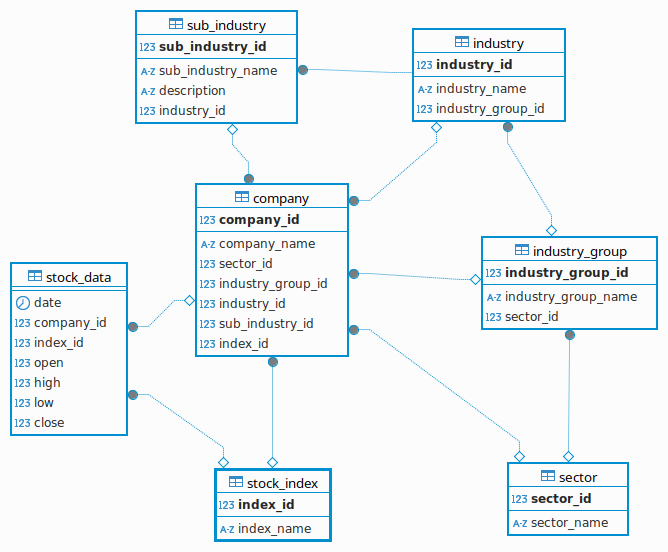

# Analyzer 
## Project description
This project aims to use technical chart analysis paired with fundamental analysis and the tools of descriptive 
statistics to make predictions about the development of certain values, companies or indices on the financial market.


## Features
- A working algorithm for determining the [pivot](https://chartschool.stockcharts.com/table-of-contents/technical-indicators-and-overlays/technical-overlays/pivot-points) levels on a chart.
	
- A working algorithm for determining the [standard deviations](https://en.wikipedia.org/wiki/Standard_deviation) of a stock from the opening price of each month.
    
### Planed Features
- Switch to a Maria DB database
- #### Implement the following ERM diagram:
	

Here you can see a star schema of database tables that I plan to use in my mariadb server. I need this to better 
classify the companies whose share prices I am analyzing. I use the [gics](https://en.wikipedia.org/wiki/Global_Industry_Classification_Standard) standard for this.

## Build With
- Python
	- pandas
	- requests
	- sqlite3 (Database)
	- plotly

## Important developments
As part of the project, I developed a rudimentary ERM mapper, or more accurately, a database driver. I was looking for 
a way to abstract the complexity of database queries in the code but at the same time keep it flexible enough for my 
needs. Here you can see the SqliteDatamanager class, which only contains two methods, select and query. The select 
method only has read access to the database and query also has write access. Use it and be happy with sqlite :slightly_smiling_face:

```python
import mysql.connector
import logging
from time import sleep


logger = logging.getLogger(__name__)
logging.basicConfig(filename="datalayer.log", encoding="utf-8", level=logging.ERROR,
                    format='%(asctime)s - %(name)s - %(levelname)s - %(message)s', datefmt='%Y-%m-%d, %H:%M:%S')

class MysqlConnectorManager:

    def __init__(self, config: dict):

        self.config = config

    def init_conn(self, attempts=3, delay=2):

        """
        Initialize the connection with my mariadb database.

        :param attempts: amount of attempts
        :param delay: waiting seconds for trying to reconnect
        """

        attempt = 1
        # Implement a reconnection routine
        while attempt < attempts + 1:
            try:
                return mysql.connector.connect(**self.config)
            except (mysql.connector.Error, IOError) as err:
                if attempts is attempt:
                    # Attempts to reconnect failed; returning None
                    logger.info("Failed to connect, exiting without a connection: %s", err)
                    return None
                logger.error(
                    "Connection failed: %s. Retrying (%d/%d)...",
                    err,
                    attempt,
                    attempts - 1,
                )
                # progressive reconnect delay
                sleep(delay ** attempt)
                attempt += 1
        return None

    def select(self, sqlstring):

        mydb = self.init_conn()
        cursor = mydb.cursor()

        try:
            cursor.execute(sqlstring)
        except (mysql.connector.Error, IOError) as err:
            raise err

        result = cursor.fetchall()
        mydb.close()
        return result

    def query(self, sqlstring, val=None) -> int:

        mydb = self.init_conn()
        mycursor = mydb.cursor()

        try:
            if isinstance(val, list):
                mycursor.executemany(sqlstring, val)
            elif isinstance(val, tuple):
                mycursor.execute(sqlstring, val)
            elif not val:
                mycursor.execute(sqlstring)

        except (mysql.connector.Error, IOError) as err:
            raise err

        mydb.commit()
        mydb.close()
        return mycursor.rowcount

```